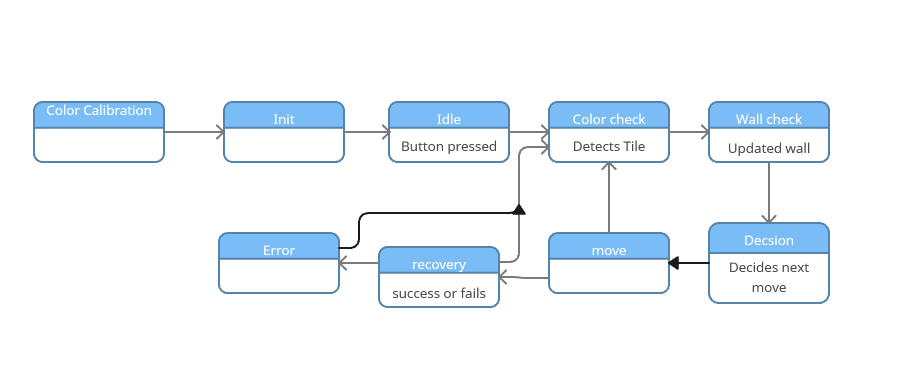

# MECA130 Mouse Robot
[[_TOC_]]

## Project Description

### Challenge Brief
An earthquake has struck. A building has been damaged and there are people trapped inside who cannot move. Others have made their own way to an assembly point and are waiting.

The building is too unsafe to send anybody in, so an autonomous robot goes instead. Once it is inside, nobody can help it. Every decision it makes is one you wrote beforehand.

### What the Robot has to do
1. Search the building and find every survivor (blue tiles).
2. Avoid the sections that are still collapsing (red tiles), and record where they were.
3. Collect supply caches (yellow tiles) along the way if the route allows.
4. Gather everybody at the assembly point, which is the green tile.
5. Evacuate: find its own way back out through the entry point it came in by (the white start tile).

### Scoring
| action                 | points |
|------------------------|--------|
| Find survivor          | +100   |
| Find cache             | +50    |
| Deploy and exit        | +200   |
| React to collapse      | +0     |
| Drive through collapse | -25    |
| Return to collapse     | -25    |

### Tile Colors
| color  | meaning        | `Tile` type     |
|--------|----------------|-----------------|
| black  | normal floor   | `TILE_NORMAL`   |
| white  | start / exit   | `TILE_START`    |
| red    | hazard         | `TILE_HAZARD`   |
| green  | assembly point | `TILE_ASSEMBLY` |
| blue   | survivor       | `TILE_SURVIVOR` |
| yellow | supply cache   | `TILE_CACHE`    |

Counts used by the objective logic are set in `GlobalDefs.h` (currently 3 survivors, 3 caches, 1 hazard, 1 assembly tile).

## Hardware

| device               | port / name          | notes                                  |
|----------------------|----------------------|----------------------------------------|
| Optical sensor       | `PORT1`              | tile hue and brightness, light on      |
| Distance sensor      | `PORT5`              | wall detection ahead                   |
| Left motor           | `PORT6`              | normal direction                       |
| Right motor          | `PORT12`             | reversed (mirrored mounting)           |
| Touch LED            | `PORT10`             | user input and status light            |
| Bumper               | `PORT11`             | skip input during calibration          |
| Inertial sensor      | `right` (brain)      | heading for `smartdrive` turns         |

Drivetrain: `smartdrive` with a 63.6 mm wheel, 300 mm cell size.

## Code Layout
| file                  | purpose                                                         |
|-----------------------|-----------------------------------------------------------------|
| `main.cpp`            | Robot state machine, hardware setup, drive and wall handling    |
| `ColorCalibration.*`  | Hue and brightness calibration and tile classification          |
| `navigation.*`        | Maze map, exploration, path planning, objective logic           |
| `GlobalDefs.*`        | Shared constants and the `TileColor` enum                       |
| `micromouse.cpp`      | Simulator entry point (only compiled with `Micromouse` defined) |
| `dataStructs/`        | `Stack` and `Queue` used by navigation                          |

## Design

### States
The program starts in `color calibration`. Every state is a handler function in `main.cpp`, called once per loop by `runStateMachine()`.

#### State Transition Table
| current state     | event                         | next state        |
|-------------------|-------------------------------|-------------------|
| color calibration | calibration done or skipped   | init              |
| init              | inertial sensor calibrated    | idle              |
| idle              | touch LED pressed             | color check       |
| color check       | tile type classified          | wall check        |
| wall check        | wall-ahead result stored      | decide            |
| decide            | turn, forward or reverse      | move              |
| decide            | `IDLE` (exploration finished) | idle              |
| move              | move complete                 | color check       |
| error             | placed on correct cell, press | color check       |

`recovery` is sketched in `handleRecovery()` but is commented out and not yet part of the dispatcher, so nothing currently transitions into `error`.

#### State Diagram


### Color Calibration
Calibration runs at startup so the robot does not depend on hard-coded hue ranges that change with lighting.

**Procedure**
1. Tiles are calibrated in this order: black, red, green, blue, yellow, white.
2. Place the optical sensor over the prompted tile. The brain screen shows live hue, brightness and the current prediction.
3. Press the **touch LED** to save that tile, or the **bumper** to skip it and keep the default.
4. Holding the **bumper** at the very first (black) step skips the whole calibration.
5. After the last tile, place the robot on the start tile facing the start direction and press the touch LED to begin.

**How it works**
- **Hue is circular.** `wrapHue`, `hueDistance` and `circularMean` handle the 0/360 seam, so red samples such as 356 and 4 average to about 0, not 180.
- **Colored tiles** take `NUM_SAMPLES` (10) readings. The band center is the circular mean. The tolerance is the widest spread seen plus 10 degrees, clamped to 10-45 degrees.
- **Black** is decided by brightness only. The threshold is the average black brightness plus `BLACK_MARGIN`, clamped to `BLACK_THRESH_MIN`-`BLACK_THRESH_MAX`. If black calibration is skipped, `BRIGHT_LOW` is the fallback.
- **Classification** (`classifyTileColor`): below the black threshold is black. Otherwise the nearest calibrated hue center wins if it is inside its tolerance band. Anything outside every band falls back to white.

### Navigation
Navigation keeps a 16x16 map of `Cell`s (tile type plus four walls) and decides one action per call to `decide(wallFront, color)`.

1. **Map the cell.** On the first visit the robot turns right four times, recording whether a wall is ahead at each heading, then records the tile type. Walls are written to both neighbouring cells.
2. **Handle hazards.** A red tile is marked as a hazard, counted, and the robot reverses out immediately. Hazards are never used for paths or exploration targets.
3. **Choose a target.**
   - Explore: unvisited reachable neighbours are pushed on a stack and the next one is popped as the target (depth-first exploration).
   - If the assembly tile is known and a survivor is underfoot, carry them to the assembly tile.
   - Once the assembly tile is found and all survivors and caches are found, go to the assembly tile, then return to the start cell `(0, 0)`.
4. **Plan the path.** Breadth-first search over mapped, non-hazard cells builds a queue of `LEFT`, `RIGHT` and `FORWARD` actions to the target.
5. **Execute.** One queued action is returned per call, and the stored position and heading are updated to match.

`decide()` returns `IDLE` only when exploration is finished, the run is complete, or nothing is left to explore.

## Simulation
The navigation logic can be run in the [Micromouse simulator](https://github.com/mackorone/mms) without the robot. `micromouse.cpp` is wrapped in `#ifdef Micromouse`, so the macro must be defined.

Build command:
```
gcc -D Micromouse -o a.exe ./API/API.cpp micromouse.cpp navigation.cpp
```
In the simulator, tile colors are placed randomly by `mazeInit()` using the counts in `GlobalDefs.h`, and a debug string with position, target and objectives found is logged each step.

## Known Limitations / TODO
- Recovery state (`handleRecovery`) is disabled and `error` is unreachable.
- Collision detection is not implemented (marked as an extension point in `handleMove`).
- `REVERSE` is handled in the simulator but not yet in the robot's `handleDecide`/`handleMove`.
